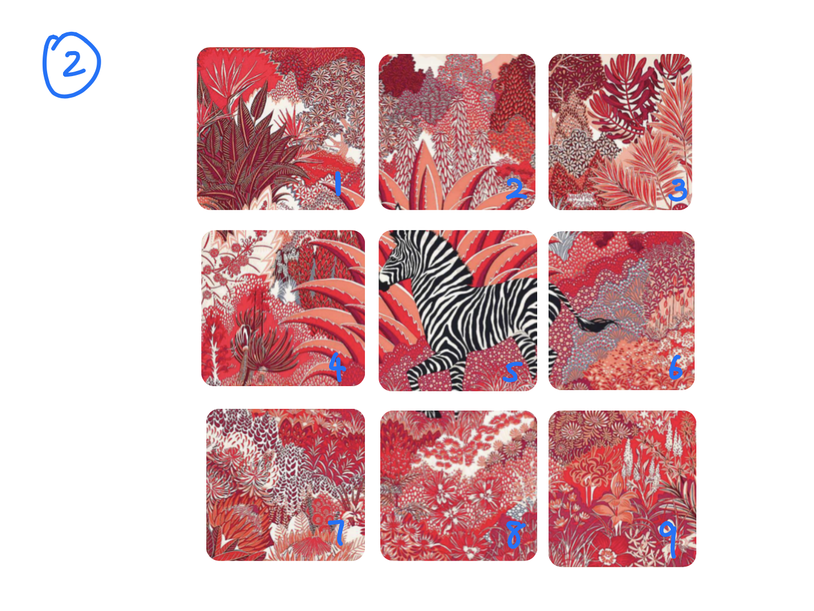
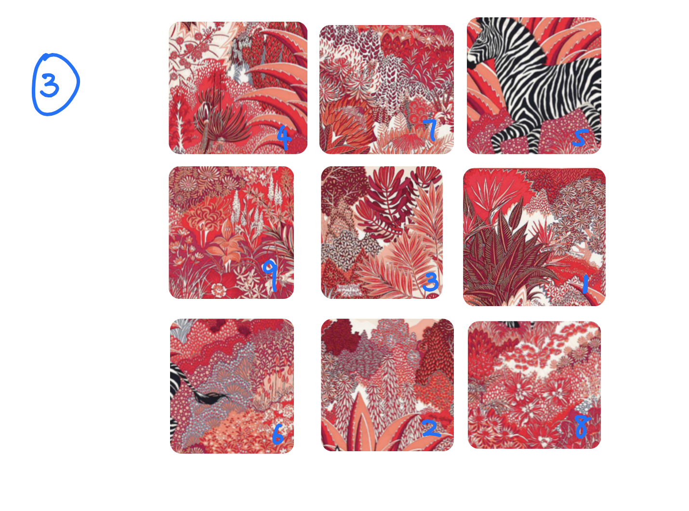

# PicShredder

1. A user can choose a picture then render on the dashboard (the upload feature will be added later as a bonus)
2. A user can choose the size of the grid from 3x3 to 12x12 also displaying on the dashboard
3. The uploaded picture will be cut by the grid then each fragment will be signing a number sort by ASC
4. All fragments will be shuffled randomly then it will generate a new unordered picture
5. A user can choose a sort method such as bubble sort, merge sort or quicksort eventually restore this picture

## WireFrame

