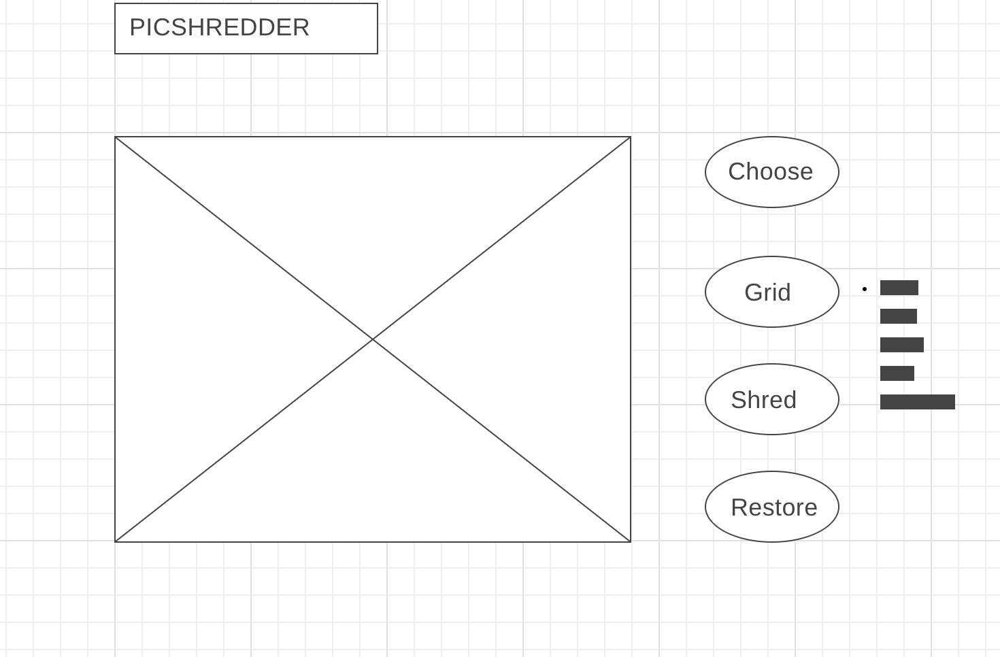

# PicShredder
Nowadays, more people prefer to use Snapchat to share the moment with your friends. The picture is burned after you check it. However, your friends probably will not be going to remember anything after a few minutes. Maybe there is another solution, the picture can be segmented and recombined, you can still keep the impression when someone comes back to your timeline without showing details.

## Functionality
1. A user can choose a picture then render on the dashboard (the upload feature will be added later as a bonus)
2. A user can choose the size of the grid from 3x3 to 12x12 also displaying on the dashboard
3. The uploaded picture will be cut by the grid then each fragment will be signing a number sort by ASC
4. All fragments will be shuffled randomly then it will generate a new unordered picture
5. A user can choose a sort method such as bubble sort, merge sort or quicksort eventually restore this picture (input visualize animation here, show the sort process and adjustable speed)

## Technologies
1. Html canvas
2. javascript

## WireFrame

## Demo

